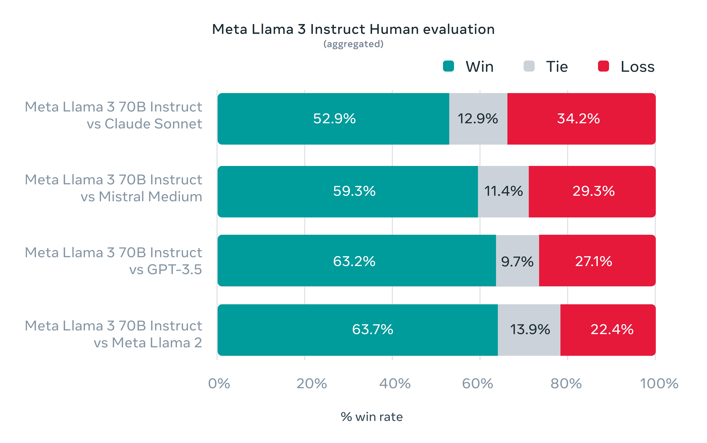

# LLaMA-3

摘要：
Llama-3模型是一个由Meta推出的最新语言模型，于2024-04-18发布，它在语言细微差别的理解、上下文理解以及复杂任务执行方面展现出了领先的性能。这个模型是公开可访问的，旨在为研究人员和开发者提供强大的工具，以推动人工智能领域的进步。

Llama-3模型发布包括了多个版本，模型大小从8B到70B参数不等，以适应不同的需求和应用场景。这些模型基于Llama-2架构，介绍了4种新的开放的大型语言模型(LLM)。这些模型在对话/聊天等用例上进行了指令调优，优化后的模型在许多常见的对话场景中都优于现有的开源聊天模型。

Llama 原始的意思是“美洲驼【A llama is a South American animal with thick hair, which looks like a small camel without a hump.】”。

## 基础信息

- 由Meta AI的GenAI团队开发
- 发布于2024年4月18日
- 训练数据：15T tokens 数据
- LLaMA是一种基于变换器网络（Transformer）架构的自回归语言模型。该模型有不同的参数规模：8B、70B参数
- 训练序列长度8192（8K） 。

## 资料集合

[代码仓库](https://github.com/meta-llama/llama3)
[技术报告](https://ai.meta.com/blog/meta-llama-3/)
[模型](https://huggingface.co/meta-llama)

## 参数

|名称|LLaMA3-7B|LLaMA-8B|
|:-|:-|:-|
|参数规模params|70B|8B|
|隐变量维度dimension|8192|4096|
|自注意力头的个数n heads|64|32|
|GQA分组数量|8|4|
|层数n layers|80|32|
|词表大小Vocab size|128k|128k|
|输入序列长度sequence length|8192|8192|
|数据规模词元数量n tokens|15T|15T|
|知识截止时间|2023年12月|2023年3月|

## 算力设施

- Meta’s large-scale AI clusters
- 24,576 NVIDIA Tensor Core H100 GPUs
- 资料来源：https://engineering.fb.com/2024/03/12/data-center-engineering/building-metas-genai-infrastructure/

## 模型下载
- 官方下载： [HuggingFace](https://huggingface.co/meta-llama)，需提交授权申请，基本都会批准的。
- 非官方： [HuggingFace](https://huggingface.co/TheBloke) 

## 效果方面

## 训练数据

指15T Tokens的公开数据(A new mix of publicly available online data)，未详细披露数据情况。

LLaMA-3-8B 无监督训练数据截至2023年3月；
LLaMA-3-70B 无监督训练数据截至2023年12月；

## 模型架构

参考文章
  
  

